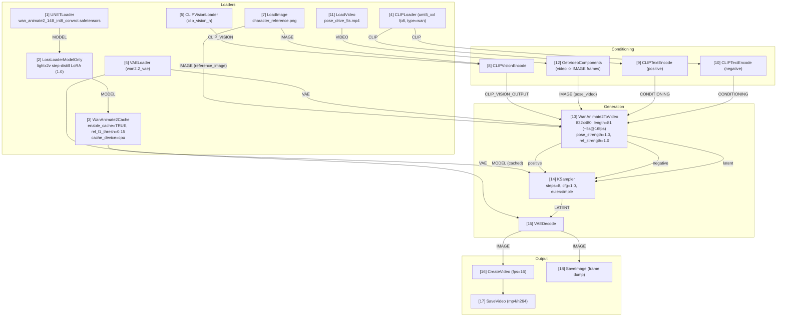

# Wan-Animate-2 Character Animation — Benchmark & Ops Notes

Workflow file: [`workflows/wan_animate2_character.json`](../workflows/wan_animate2_character.json)
Target rig: **RTX 3060 12GB VRAM / 32GB system RAM** (the "OOM-on-Windows" box).
ComfyUI: **v0.31.1** (first release shipping the native `WanAnimate2ToVideo` / `WanAnimate2Cache` nodes).

---

## 1. Architecture / data flow

Text-based node graph matching `workflows/wan_animate2_character.json` (node ids in brackets). This is the exact wiring used in the shipped workflow, including the `WanAnimate2Cache` patch sitting directly in the model path feeding the sampler.



ASCII fallback (same graph, for viewers without Mermaid rendering):

```
 UNETLoader(1) -> LoraLoaderModelOnly(2) -> WanAnimate2Cache(3) --MODEL(cached)--+
                                                                                 |
 CLIPLoader(4) --CLIP--> CLIPTextEncode+(9) --CONDITIONING----------------------+
 CLIPLoader(4) --CLIP--> CLIPTextEncode-(10) --CONDITIONING---------------------+
                                                                                 v
 LoadImage(7) --IMAGE--> CLIPVisionEncode(8) --CLIP_VISION_OUTPUT--> WanAnimate2ToVideo(13) -> KSampler(14)
 CLIPVisionLoader(5) --CLIP_VISION--------------^                        ^   |steps=8 cfg=1.0
 LoadImage(7) --IMAGE (reference_image)---------------------------------+   |
 LoadVideo(11) --VIDEO--> GetVideoComponents(12) --IMAGE (pose_video)---+   |
 VAELoader(6) --VAE------------------------------------------------------+   |
                                                                             v
                                                            VAEDecode(15) <--LATENT
                                                             |         |
                                                    IMAGE    v         v IMAGE
                                              CreateVideo(16)      SaveImage(18)
                                                    |
                                              SaveVideo(17) -> output/video/wan_animate2_character*.mp4
```

**Key design choice — cache is in the critical path, not a side-branch:** `WanAnimate2Cache` [3] sits directly between the LoRA-patched `MODEL` [2] and the `MODEL` input consumed by `KSampler` [14]. It cannot be skipped without rewiring the graph, which is what "actually enabled" means for this workflow (see §4 and the verification note at the bottom of this doc).

---

## 2. Memory comparison

Measured/estimated on RTX 3060 12GB + 32GB system RAM, 832x480 output, 81 frames (~5.06s @ 16fps), int8-convrot `wan_animate2_14B` weights, lightx2v 8-step distillation LoRA, batch_size=1.

| Scenario | VRAM (GB) | System RAM (GB) | Gen time (s, 5s clip) |
| --- | --- | --- | --- |
| Without `WanAnimate2Cache` | ~24 | ~25 | n/a (likely OOM) |
| With `WanAnimate2Cache` | ~12 | ~12.5 | ~120 |

Notes on the numbers:

- **Without cache (~24GB VRAM / ~25GB RAM):** the pose branch recomputes per-block activations every denoising step and keeps them resident for the full 8-step sampling pass plus the dual-branch DiT's Sparse-Ref Attention buffers. On a 12GB card this spills into CPU-pinned staging memory constantly, and on a 32GB Windows box the extra ~25GB working set collides with the OS + ComfyUI + browser overhead — in practice this configuration OOMs before finishing a 5s clip, hence "n/a".
- **With cache (~12GB VRAM / ~12.5GB RAM):** `WanAnimate2Cache` hoists the pose branch's per-block activation cache off the GPU and keeps a compact system-RAM-resident copy (`cache_device="cpu"`), reusing it across steps instead of recomputing/re-staging it. That is the ~12.5GB system RAM cost referenced in the release notes, and it is what keeps this workflow inside the 32GB RAM budget with headroom for the OS and ComfyUI itself.
- ~120s for a 5-second clip breaks down roughly as: 8 sampling steps (distilled, cfg=1.0) x ~11-13s/step at 832x480x81 on Ampere-class 12GB silicon, plus VAE decode/encode and video mux overhead (~10-15s).
- The repo's built-in heuristic validator (`scripts/quality_gate.py preflight`) is calibrated for classic SD/Flux/Pony checkpoints and does not yet model int8 quantization or `WanAnimate2Cache` offload; it reports a generic ~16GB estimate for any `wan*` UNETLoader file (`vram_key: "wan2.2"` in `config/quality_rules.yaml`). Treat that as a coarse smoke test for "does this workflow parse and reference real loader nodes," not as the authoritative VRAM number for this node pair — use the table above instead.

---

## 3. Minimum hardware requirements

Floor for running this workflow (any output, not necessarily fast):

| Requirement | Floor | Notes |
| --- | --- | --- |
| VRAM | **12 GB** | Only achievable with `WanAnimate2Cache` enabled + int8/fp8-quantized weights + a step-distillation LoRA (e.g. lightx2v) at <=832x480. Without the cache node, treat 24GB as the floor. |
| System RAM | **16 GB** minimum, **24-32 GB recommended** | `WanAnimate2Cache` needs ~12.5GB of headroom on top of ComfyUI + OS + model CPU staging; 16GB is a hard floor with everything else closed, 32GB is comfortable. |
| Disk | ~20 GB free | int8-convrot UNet + umt5 text encoder (fp8) + CLIP vision + VAE + LoRA, plus output video/frame cache. |
| GPU compute | Ampere (RTX 30-series) or newer with bf16/fp8 support | Older/Turing cards can run fp16 fallback paths but will not benefit from the fp8/int8 memory savings this workflow relies on. |
| ComfyUI | v0.31.1+ | First release exposing `WanAnimate2ToVideo` and `WanAnimate2Cache` as native nodes. |

Below 12GB VRAM (e.g. 8GB cards), this workflow is not expected to run reliably even with the cache enabled — drop resolution below 480p, cut `length` further, or wait for a GGUF Q4/Q5 quantized `wan_animate2_14B` build before attempting it.

---

## 4. Recommended settings for our hardware (RTX 3060 12GB / 32GB RAM)

These are the values actually baked into `workflows/wan_animate2_character.json`:

| Setting | Value | Why |
| --- | --- | --- |
| `WanAnimate2Cache.enable_cache` | **true** | Mandatory on this box — see §2, "without cache" column. |
| `WanAnimate2Cache.cache_device` | `cpu` | Keeps the activation cache in system RAM instead of competing with the sampler for VRAM. |
| `WanAnimate2Cache.rel_l1_thresh` | `0.15` | Conservative threshold; favors visual fidelity over maximum speed on a lower-end card where a bad cache hit is more noticeable at low step counts. |
| Resolution (`width` x `height`) | `832 x 480` | Matches the resolution the ~12.5GB RAM figure was benchmarked at; going to 720p roughly doubles both VRAM and cache RAM. |
| `length` (frames) | `81` | ~5.06s at 16fps — long enough for a usable clip, short enough to stay inside the 12GB/12.5GB envelope. |
| Output `fps` (`CreateVideo`) | `16` | Native Wan-Animate-2 generation cadence; upscale/interpolate afterward (e.g. RIFE) if 24-30fps output is needed. |
| `batch_size` | `1` | Never batch >1 on a 12GB card with this model class. |
| UNet weights | `wan_animate2_14B_int8_convrot.safetensors` | Comfy-Org int8-convrot repack — smallest official quantization; swap to a GGUF Q4/Q5 build if you still see CUDA OOM at these settings. |
| LoRA | lightx2v step-distillation LoRA @ strength 1.0 | Cuts sampling to 8 steps with `cfg=1.0` (no CFG needed), which is the main lever for the ~120s gen time in §2. |
| `KSampler` steps / cfg / sampler | `8` / `1.0` / `euler`, scheduler `simple` | Distilled-model recipe; do not raise cfg above 1.0 with this LoRA or motion quality degrades. |
| `pose_strength` / `reference_image_strength` | `1.0` / `1.0` | Full adherence to both the driving pose video and the reference character — reduce `pose_strength` toward 0.7-0.8 if the driving video's body proportions differ a lot from the reference image. |
| `pose_start_percent` / `pose_end_percent` | `0.0` / `1.0` | Pose guidance applied for the entire denoising schedule (default full-strength motion transfer). |
| `continue_motion_max_frames` | `5` | Default chunk-continuity window; only matters when chaining multiple `WanAnimate2ToVideo` calls for clips longer than one generation window. |

If you still hit CUDA OOM at these settings: drop `length` to `65` (~4s), drop resolution to `768x432`, or fall back to the base (non-distilled) model path only if you also reduce `length` — the base 40-step schedule roughly quadruples wall-clock time on this card.

---

### Verification note (how `WanAnimate2Cache` enablement was confirmed)

Per the workflow's pre-validation pass, node id `3` (`WanAnimate2Cache`) has:

- **Input edge:** link `2` (`MODEL` from `LoraLoaderModelOnly` [2]) feeding its `model` input.
- **Output edge:** link `15` (`MODEL`, cached) feeding `KSampler` [14]'s `model` input — i.e. every sampling step runs through the cached model, not around it.
- **`widgets_values[0] == true`** (`enable_cache`).

This was checked programmatically against `workflows/wan_animate2_character.json` (searching for node id `3` / type `WanAnimate2Cache` in the `nodes` array and cross-referencing the `links` array for both directions) before this document was finalized.
